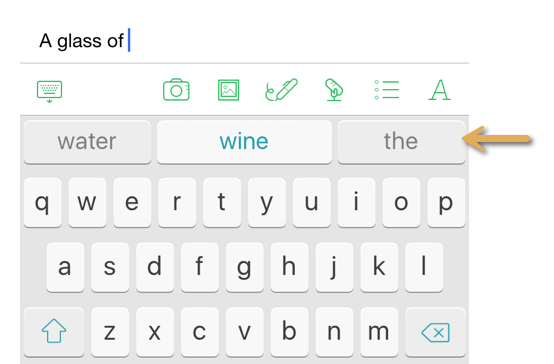
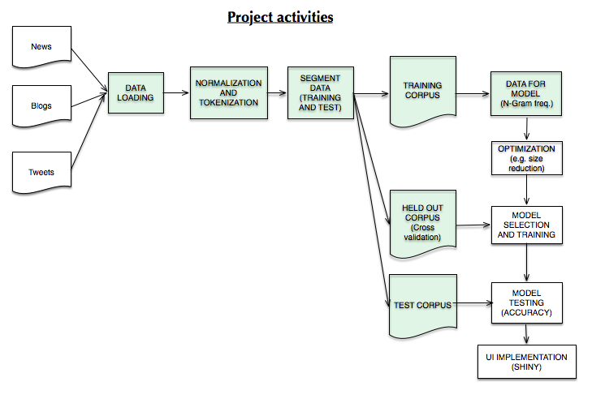

<style type="text/css">
/*  CSS chunck 1  */
th {  background-color:#E0E0E0 ;
      border-bottom:1px solid black;
      padding:5px;}

td{
border-bottom:1px dotted black;
padding:5px;}

table{ 
border-collapse:collapse;
margin:auto;
 border: 1px solid black;}
</style>
 
   
***   
   
## Executive Summary

The goal of this project is to develop a data product showcasing  a predictive algorithm assisting a user typing on a keyboard.   
    
The system should propose to the user the most probable next words from the beginning of a sentence.  
    
Similar types of predictive algorithms are widely spread and used in many applications: 
   
* Type ahead capabilities on search engines or eCommerce sites  
   
* Word prediction on mobile keyboard (standard iOS keyboard)   
    
The Swiftkey predictive keyboard is another example of application.   
   
See a screenshot of the "Swiftkey" assistive keyboard below for illustration purpose where "wine", "water", and "the" are the next words predicted for "a glass of" - as the user types.   
   
      
<center></center>
   
<p/>
<p/>
In this project, we use a corpus of textual data from various sources (news, blogs, tweets) to train a predictive model, and implement a basic user interface illustrating the power of the model.   
   
The model will predicts the next words that are the most likely, given the beginning of a sentence.    
   
We will use the concept of word N-Gram language model to design the predictive algorithm (see on Wikipedia N-Gram [language model](https://en.wikipedia.org/wiki/N-gram)).  
    
Even though this is a 'proof of concept' project done entirely using RStudio and the R programming language, the same algorithms and methodology can be used to implement a production application (using probably a different language, for instance Objective C on iOS, to achieve scale and speed).      
   
The goal of this milestone report is to provide basic statistics on the textual corpus used for this project, report the results of data exploration on N-Grams constructed on the training data, and provide an overview of the activities I planned in order to complete the project.   
   
***   
   

##1) Data source: corpus used for the project
     
###1.1) Basic data source statistics
   
Here are the basic statistics for the 3 data source files used for the Capstone project. I used the english version of the source files.     
    
As expected, the Twitter file has less words per document (given the 140 character limitation of Tweets).  
Each three data source has a comparable number of characters. 
  
The news and blog text files contain more words by line (document).  
   
   
File name            |  Twitter    |  News        | Blog         |
---------------------|-------------|--------------|--------------|   
Lines                |  2,360,148  |  1,010,242   | 899,288       |
Words                | 30,374,206  | 34,372,720   | 37,334,690   |
Characters           | 167,105,338 | 205,811,889  | 210,160,014  |
Words per line       |  12.87      |  33.92       |   41.52      |
Characters per word  |  5.5        |  5.99        |   5.63       |

###1.2) Data loading 
   
The 3 corpus were combined to use a corpus that has a variety of writting styles, to have a general purpose model applicable to a broad set of textual sources (Tweets, eMail etc). 
  
Once loaded and combined, the textual data was cleaned and tokenized, before doing data exploration in the area of N-Grams frequencies, data volumes and corpus coverage by unique N-grams.   
   
      
***   
     
##2) Data exploration
   
###2.1) Frequency of N-grams
   
In this section we explore the data features of the text corpus we used for training purpose. Each data file has been sampled at 15% (sampling at 15% of the lines/documents loaded by file) and combined in a unique textual corpus.    
      
After data normalization and tokenization, this represents a corpus of about 17.5 Million tokens (words).  
         
Frequencies and cumulative frequencies were computed for unigrams, bigrams, trigrams and quadrigrams (even though I report up to the trigram for brevity of the milestone report).      
      
If we look at the top 100 unigrams, bigrams and trigrams in terms of frequencies, we can notice that bigrams and trigram graphs have a 'longer tail' (e.g. when ordered by frequecy, the frequency of trigrams slowly decrease compared to bigrams, and even more compared to unigrams).   
   
In addition, the number of unique N-Grams increases signnificantly with N: 283K for unigram, 3.39M for bi-grams, 8.29M for tri-grams. It means that as N increases (and as the corpus size increases), the storage capacity required to store N-Grams will very significantly increase.  
   
**Note:** for reference, you can see in annexes the top 10 unigrams, bigrams and trigrams (from the training corpus).
   
```{r cache=FALSE, echo=FALSE, warning=FALSE, error=FALSE, fig.width=10,fig.height=2.5 }

tk_us <- readRDS("./data/tk_us");
tk_bs <- readRDS("./data/tk_bs");
tk_ts <- readRDS("./data/tk_ts");

library(ggplot2);
library(gridExtra);

#####################################################
# Show frequency graphs for 1, 2, 3 grams

#Plot cumulativefrequency by unigram
p1 <- ggplot(tk_us[1:100,], aes(x=pos, y=Freq));
p1 <- p1 + geom_bar(stat = "identity",  fill="darkblue");
p1 <- p1 +  labs(x="Unigram",y="Frequency",title="Frequency - top unigrams");
p1 <- p1 + theme(axis.title.x = element_text(size = 9),
                 title =element_text(size=9, face='bold')) +
  theme(axis.title.y = element_text(size = 9));

p2 <- ggplot(tk_bs[1:100,], aes(x=posb, y=bFreq));
p2 <- p2 + geom_bar(stat = "identity",  fill="darkblue");
p2 <- p2 +  labs(x="Bigram",y="Frequency",title="Frequency - top bigrams");
p2 <- p2 + theme(axis.title.x = element_text(size = 9),
                 title =element_text(size=9, face='bold')) +
  theme(axis.title.y = element_text(size = 9));

p3 <- ggplot(tk_ts[1:100,], aes(x=post, y=tFreq));
p3 <- p3 + geom_bar(stat = "identity",  fill="darkblue");
p3 <- p3 +  labs(x="Trigram",y="Frequency",title="Frequency - top trigrams");
p3 <- p3 + theme(axis.title.x = element_text(size = 9),
                 title =element_text(size=9, face='bold')) +
  theme(axis.title.y = element_text(size = 9));

# Print plot in a grid
grid.arrange(p1, p2, p3, ncol=3);

```
   
   
###2.2) N-Grams cumulative frequencies and coverage
    
Below are the cumulative frequency graphs for the top 10,000 unigrams, bigrams and tri-grams. These graphs show clearly that to get a comparable coverage for the same corpus, you need significantly more bigrams than unigrams, and similarly you need more trigrams than bigrams. 
   
This conclusion can be extended to quadrigrams as well. 
   
```{r cache=FALSE, echo=FALSE, warning=FALSE, error=FALSE, fig.width=10,fig.height=2.5 }

library(ggplot2);
library(gridExtra);

#####################################################
# Show frequency graphs for 1, 2, 3 grams
#Plot cumulativefrequency by unigram
p1 <- ggplot(tk_us, aes(x=pos, y=cumsum));
p1 <- p1 + geom_bar(stat = "identity",  fill="darkred");
p1 <- p1 +  labs(x="Unigram",y="Frequency",title="Cumulative frequency - unigrams");

p1 <- p1 + theme(axis.title.x = element_text(size = 9),
               title =element_text(size=9, face='bold')) +
  theme(axis.title.y = element_text(size = 9));

        
p2 <- ggplot(tk_bs, aes(x=posb, y=cumsumb));
p2 <- p2 + geom_bar(stat = "identity",  fill="darkred");
p2 <- p2 +  labs(x="Bigram",y="Frequency",title="Cumulative frequency - bigrams");

p2 <- p2 + theme(axis.title.x = element_text(size = 9),
                 title =element_text(size=9, face='bold')) +
  theme(axis.title.y = element_text(size = 9));


p3 <- ggplot(tk_ts, aes(x=post, y=cumsumt));
p3 <- p3 + geom_bar(stat = "identity",  fill="darkred");
p3 <- p3 +  labs(x="Trigram",y="Frequency",title="Cumulative frequency - trigrams");
p3 <- p3 + theme(axis.title.x = element_text(size = 9),
                 title =element_text(size=9, face='bold')) +
  theme(axis.title.y = element_text(size = 9));

# Print plot in a grid
grid.arrange(p1, p2, p3, ncol=3);

```
   
   
The table below summarizes how many unique N-grams are needed to get a 50% and 90% coverage in the whole corpus. Significantly more N-grams are needed to get a similar coverage as the number N increases. For instance 16.6% of the trigrams ( 1,379k/8.29M ) are required to cover 50% of the corpus, while 0.03% of unigrams (92/283K) cover 50% of the corpus.  
      
N-gram    |  50 pct of coverage |90 pct of coverage  |
---------|-----------------|------------------------|
Unigram  |  0.03% (95)     |  2.45%  (6,945)         | 
Bigrams  | 0.81% (25.7K)     |   5.6%  (189.96 K)         |
Trigrams |  16.6% (1,379K)   |   83.3%  (6,906K)       | 
<p/>
  
**What does it mean?**   
   
It means the use of N-Grams as N increases (trigrams, quadrigrams) while providing in theory more predictive power, will significantly increase resource costs (storage, CPU). Optimization techniques such as storing only top N-grams in terms of frequency  will be required as a trade-off (and are detailed in section 3).
          
Another trade-off is to limit N to a reasonable value - and in this project I plan to use N-Grams up to N=4 (quadrigrams).   
   
In additin of the coverage issue, a known fact reported in the NLP litterature is that higher level N-Gram models are prone to over fitting, so as a conclusion using unigrams, bigrams, trigrams and quadrigrams seems a reasonable compromise at this stage of the project.     
   
***   

   
##3) Data product: project activities
    
After loading the text files and doing basic statistics on the file content, I planned the following activities to complete the project (activites in green are already completed).   
   
<center></center>
   
###3.1) Data normalization and tokenization
            
The text has been normalized by the following process (I used combinatin of regular expressions and the "quanteda" R package for this activity):      

* converting all text to lower case, removing punctuations and separators.  

* beginning and end of the sentence are identified in the corpus by using specific tags (see annexes for examples). 

* Numbers are identified by using a specific tag (see annexes for examples).     

* Obscene words are identified by using a specific tag. A limited list of words was used but this can be easily expanded if needed.   
    
    
I did not remove stopwords or did not use stemming on the corpus, as it would defeat the purpose of an application predicting the next word in a sentence.   
   
Using tags for identifying beginning of a sentence in token sequences provides more context to the predictive model (for instance certain N-grams such as "thanks for" are more likely at the beginning of a sentence).  
    
Similarly, using a specific tag to identify numbers  allows the predictive model to identify certain patterns with numbers and token sequences (e.g.  in <number> minutes) instead of tokenizing all the possible numbers (this would be rather inefficient).
   
###3.2) Data segmentation for training and test
   
I created different data sets that will be used in the modelling process:   

1. Training data: used to compute N-gram frequencies. After different trials, I used 15% of the corpus, as a compromise between storage, processing time, and completeness of the training corpus. 
   
2. Held out data: I plan to use a sample of 1.5% of the sentences in the corpus to optimize the model parameters (similar concept as 'cross-validation' data set).   
   
3. Test data: I plan to use a sample of 1.5% of the sentences in the corpus to evalute the final model performance (for instance accuracy of prediction for top first, second and third words returned by the model) once the parameters are optimized.
   
   

###3.3) Compute data for predictive model
   
I computed unigrams, bigrams, trigrams and quadrigrams frequencies.
    
In addition, the following data was computed:   

* Probability of having  a  unigram given a preceding unigram  

* By extension, probability of having a unigram given a preceding bigram or trigram  
   
    
This data is used to compute the estimated probability based on the context (beginning of a sentence) and unigram, bigram, trigram and quadrigram language models.
    

### 3.4) Storage and speed optimization
   
The goal of these optimizations is to be able to obtain a model that can be run on devices with limited memory and CPU power (Smartphone).  
        
As seen in the data exploration section, as "N" increases, the cost of storing and processing N-Grams increases significantly especially if we want to keep a good coverage of the corpus.   
   
The following optimizations will be experimented in order to "compress" the data without loosing too much in terms of predictive power (this can be validated with the held out & test data sets):   
   
* keep only N-grams based on frequency threshold (e.g. freq > 5)      

* keep only top "X"" bigrams in terms of frequency given a unigram (same principle for trigrams and quadri-grams).  
    + For example, store the top 5 corresponding trigrams in terms for frequencies for the bigram "this is"  ("this is the", "this is to"", "this is and"", "this is a"", "this is of").  
    + The assumption is that we don't need to keep all the N-Grams since we predict the **top** next words based on previous N-grams.   
  
* Use R data table and keys (optimized R data structure) to optimize storage and search speed.   
   
   

###3.5) Model selection and training
   
I used at a first a simple "back-off" model to evaluate its performance. Given a sentence, a quadrigram language model is used first to find out the most likely words (e.g. "good" for this is a"). If a quadrigram does not match, use a trigram, and so forth (until we default to the most likely unigram).  
     
As a next step, I plan to use an interpolation model. The interpolation model combines the probabilities of the different N-Gram language models with weights, in order to derive a combined probability that is in theory more robust. For reference see [General linear interpolation of language models - Bo-June Hsu](https://groups.csail.mit.edu/sls/publications/2007/Hsu_ASRU.pdf).  
   
The model will be trained on the held out / cross validation data set in order to find the best parameters. Perplexity (Wikipedia reference: [perplexity](https://en.wikipedia.org/wiki/Perplexity) ) and accuracy  (Wikipedia reference: [accuracy](https://en.wikipedia.org/wiki/Accuracy_and_precision) will be used to optimize the model parameters.  
  
Last, the final model performance will be evaluated on the test data set.  
      
###3.6) User interface
    
THe Shiny application framework and cloud service "shinyapps.io" will be used to deliver  a user interface that illustrates the predictive algorithm. 
      
The optimization (data size, performance) will be useful in this context as the shinyapps.io cloud service provides limited CPU and memory capacity in its free edition.   
   
   
      
***   
    
## ANNEXES
   
**Note:** I used the following tags used to identify     

* beginning of sentence: "zzbezz""   

* number: "zznumzz""   

* obscene word: "zzobszz""   
  

### Top 10 unigrams in corpus  
  
```{r echo=FALSE, results='asis' }
#####################################################
library(knitr);
outp <- tk_us[1:10,1:3];
colnames(outp) <- c("Unigram","Frequence", "Cumulative Frequence");
kable(outp,format="html");
```
</center>

### Top 10 bigrams in corpus
  
```{r echo=FALSE, results='asis' }

#####################################################
library(knitr);
outp <- tk_bs[1:10,1:3];
colnames(outp) <- c("Bigram","Frequence", "Cumulative Frequence");
kable(outp,format="html");

```

### Top 10 trigrams in corpus
  
```{r echo=FALSE, results='asis' }

#####################################################
library(knitr);
outp <- tk_ts[1:10,1:3];
colnames(outp) <- c("Trigram","Frequence", "Cumulative Frequence");
kable(outp,format="html");

```

